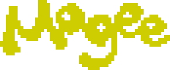
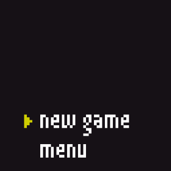

A WebGL platformer that fits into 64x64px screen.

Submitted to the [\#LOWREZJAM 2016](https://unsoundscapes.itch.io/mogee).

## Instructions to run

1. Install elm [elm-lang.org/install](http://elm-lang.org/install)
2. Clone this repo
3. Run `elm make src/Main.elm --output elm.js`
4. Open `index.html` in the browser

## Special Credits

* Pixel art by [Nadya Kuzmina](https://github.com/kuzminadya)
* Theme music and sounds by [Carlos Pazuzu](https://twitter.com/carlospazuzu)
