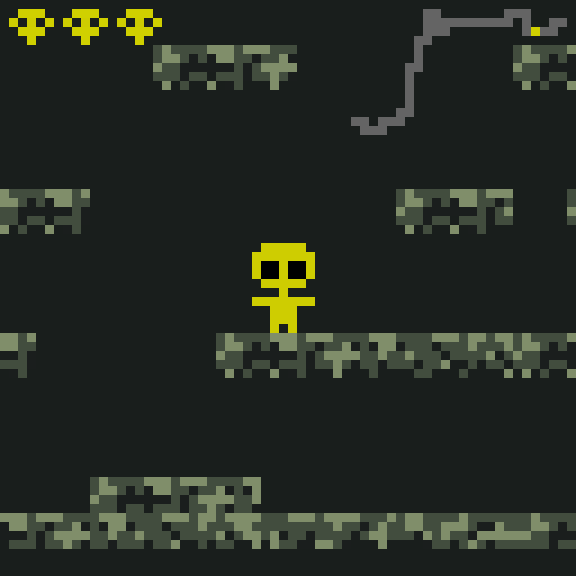

A WebGL platformer that fits into 64x64px screen.

Submitted to the [\#LOWREZJAM 2016](https://itch.io/jam/lowrezjam2016/rate/62488).

## Instructions to run

1. Install elm [elm-lang.org/install](http://elm-lang.org/install)
2. Clone this repo and `cd` into it
3. Run `elm reactor`
4. Open [localhost:8000/src/Main.elm](http://localhost:8000/src/Main.elm) in the browser
